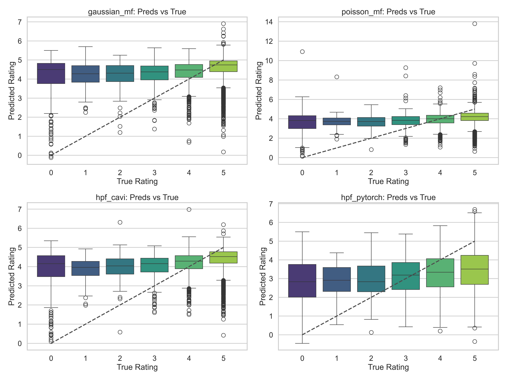
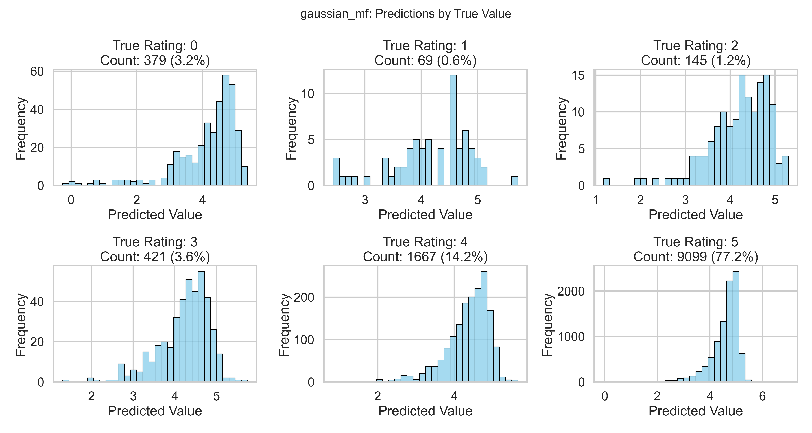
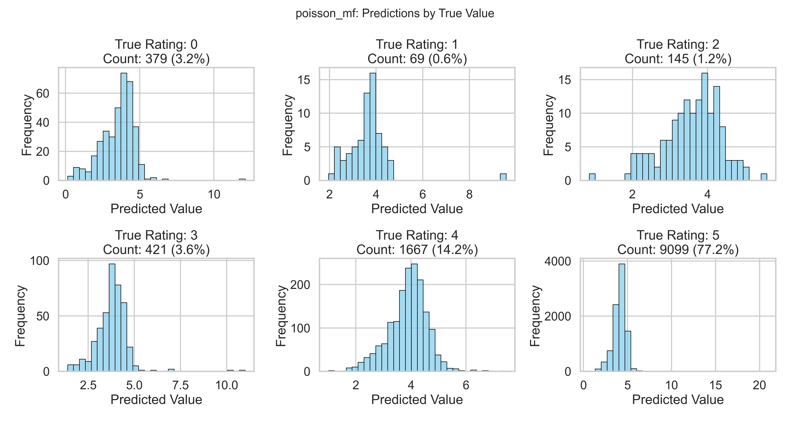
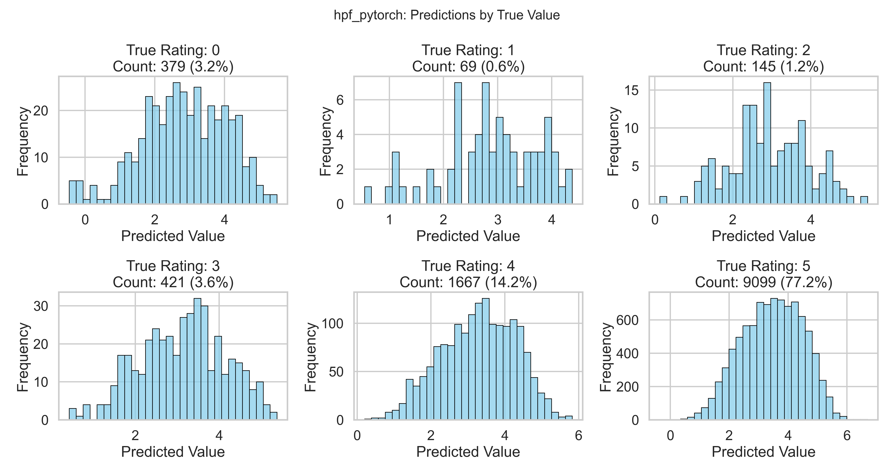

# Forecast Analysis Results

| RMSE | MAE | MSE | R2 | Model |
| --- | --- | --- | --- | --- |
| 1.0895587667197304 | 0.6525213114094308 | 1.18713830613582 | -0.07457162341936785 | gaussian_mf |
| 1.254670010695706 | 0.9457974907975173 | 1.5741968357391634 | -0.42492853664881314 | poisson_mf |
| 1.0993831189851402 | 0.7396132238934334 | 1.208643242309495 | -0.09403742117539804 | hpf_cavi |
| 1.8076550167609289 | 1.502824079204754 | 3.267616659620954 | -1.9577751138959 | hpf_pytorch |

## Plots

### Predictions by True Value
#### gaussian_mf

#### poisson_mf

#### hpf_cavi

#### hpf_pytorch

